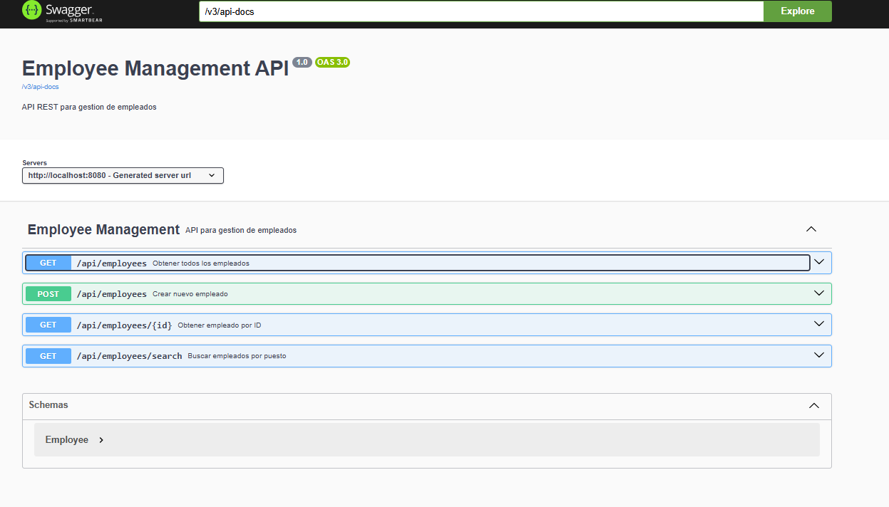

# Employee Management API

## Descripcion

API REST para gestion de empleados desarrollada en Spring Boot 3.5.5 con Java 21. Implementa operaciones CRUD basicas y busqueda por puesto.

## Caracteristicas

- GET /api/employees - Obtener lista completa de empleados
- GET /api/employees/{id} - Obtener empleado por ID
- GET /api/employees/search?puesto=xxx - Buscar empleados por puesto
- POST /api/employees - Crear nuevo empleado en memoria
- Validaciones completas usando Bean Validation
- Manejo de errores personalizado (404 Not Found, validaciones)
- Documentacion automatica con Swagger/OpenAPI
- Base de datos H2 en memoria (datos se pierden al reiniciar)
- Tests unitarios completos

## Tecnologias Utilizadas

- Spring Boot 3.5.5
- Java 21
- Spring Data JPA
- H2 Database (en memoria)
- Spring Validation
- Swagger/OpenAPI 3
- Lombok
- JUnit 5
- Maven

## Modelo de Datos

### Employee
```json
{
  "id": 1,
  "nombre": "Juan Perez",
  "puesto": "Desarrollador", 
  "salario": 8.5
}
```

**Validaciones:**
- nombre: No puede estar vacio
- puesto: No puede estar vacio
- salario: Debe ser positivo (en millones de guaranies)

## Instalacion y Ejecucion

### Prerrequisitos
- Java 21 o superior
- Maven 3.6+ (opcional, incluye Maven Wrapper)

### Clonar y ejecutar
```bash
git clone <repository-url>
cd employee
./mvnw spring-boot:run
```

En Windows:
```cmd
mvnw.cmd spring-boot:run
```

La aplicación estará disponible en: `http://localhost:8080`

## Documentacion de la API

### Swagger UI
Una vez iniciada la aplicacion, accede a:
- Swagger UI: http://localhost:8080/swagger-ui/index.html
- OpenAPI JSON: http://localhost:8080/v3/api-docs

### Vista de Swagger funcionando



**Caracteristicas visibles en Swagger:**

- ✅ 4 endpoints documentados (GET, POST, GET por ID, GET search)
- ✅ Esquema Employee con validaciones
- ✅ Descripciones en español para cada endpoint  
- ✅ Ejemplos de respuestas JSON
- ✅ Interfaz interactiva para probar la API

**Como se ve funcionando:**

1. La interfaz muestra "Employee Management API" como titulo principal
2. Version OpenAPI 3.0 (OAS 3.0) 
3. Servidor en http://localhost:8080
4. Cada endpoint tiene su color distintivo (GET en azul, POST en verde)
5. Seccion "Schemas" expandible con el modelo Employee
6. Todas las descripciones en español para uso local

Para probar cualquier endpoint, simplemente haz clic en "Try it out" y ejecuta la peticion directamente desde Swagger.

### Endpoints

**La aplicacion incluye 4 endpoints principales:**

#### 1. Obtener todos los empleados
```http
GET /api/employees
```

**Respuesta 200:**
```json
[
  {
    "id": 1,
    "nombre": "Carlos Mendoza",
    "puesto": "Desarrollador Senior",
    "salario": 12.5
  },
  {
    "id": 2,
    "nombre": "Ana Martinez", 
    "puesto": "Analista de Sistemas",
    "salario": 8.8
  }
]
```

#### 2. Obtener empleado por ID
```http
GET /api/employees/{id}
```

**Respuesta 200:**
```json
{
  "id": 1,
  "nombre": "Juan Pérez", 
  "puesto": "Desarrollador",
  "salario": 50000.00
}
```

**Respuesta 404:**
```json
{
  "timestamp": "2025-09-09T16:20:30",
  "status": 404,
  "error": "Not Found",
  "message": "Empleado con ID 999 no encontrado",
  "path": "/api/employees/999"
}
```

#### 3. Buscar empleados por puesto
```http
GET /api/employees/search?puesto=Desarrollador
```

**Respuesta 200:**
```json
[
  {
    "id": 1,
    "nombre": "Juan Pérez",
    "puesto": "Desarrollador", 
    "salario": 50000.00
  },
  {
    "id": 3,
    "nombre": "Carlos López",
    "puesto": "Desarrollador",
    "salario": 55000.00
  }
]
```

#### 4. Crear nuevo empleado
```http
POST /api/employees
Content-Type: application/json

{
  "nombre": "Ana Rodríguez",
  "puesto": "Designer",
  "salario": 48000
}
```

**Respuesta 201:**
```json
{
  "id": 5,
  "nombre": "Ana Rodríguez",
  "puesto": "Designer", 
  "salario": 48000.00
}
```

**Respuesta 400 (validación):**
```json
{
  "timestamp": "2025-09-09T16:20:30",
  "status": 400,
  "error": "Validation Failed",
  "message": "Error en la validación de datos",
  "path": "/api/employees",
  "validationErrors": {
    "nombre": "El nombre no puede estar vacío",
    "salario": "El salario debe ser mayor a 0"
  }
}
```

## 🧪 Testing

### Ejecutar tests
```bash
./mvnw test
```

### Cobertura de tests
- **EmployeeControllerTest**: Tests completos del controlador REST
- Casos de éxito (200, 201)
- Casos de error (404, 400)
- Validaciones de entrada

## 🗃️ Base de Datos

### H2 Console
Para inspeccionar la base de datos en desarrollo:
- **URL**: http://localhost:8080/h2-console
- **JDBC URL**: `jdbc:h2:mem:employeedb`
- **Usuario**: `sa`
- **Contraseña**: (vacío)

### Configuración
- Base de datos **en memoria** (se pierde al reiniciar)
- Esquema creado automáticamente por JPA
- Datos iniciales pueden agregarse via `data.sql`

## 📁 Estructura del Proyecto

```
src/main/java/py/com/employee/
├── EmployeeApplication.java           # Clase principal
├── config/
│   └── OpenApiConfig.java            # Configuración Swagger
├── controller/
│   └── EmployeeController.java       # Controlador REST
├── exception/
│   ├── EmployeeNotFoundException.java
│   ├── GlobalExceptionHandler.java   # Manejo global de errores
│   ├── ErrorResponse.java
│   └── ValidationErrorResponse.java
├── model/
│   └── Employee.java                 # Entidad JPA
├── repository/
│   └── EmployeeRepository.java       # Repositorio JPA
└── service/
    └── EmployeeService.java          # Lógica de negocio

src/test/java/py/com/employee/
└── controller/
    └── EmployeeControllerTest.java   # Tests del controlador
```

## 🎯 Decisiones de Diseño

### 1. Base de Datos en Memoria
- **H2 Database** cumple el requisito de "datos en memoria"
- Se configura con `spring.jpa.hibernate.ddl-auto=create-drop`
- Los datos se pierden al reiniciar (como especifica el desafío)

### 2. Arquitectura en Capas
- **Controller** → **Service** → **Repository**
- Separación clara de responsabilidades
- Facilita testing y mantenimiento

### 3. Manejo de Errores
- **GlobalExceptionHandler** con `@ControllerAdvice`
- Respuestas consistentes para errores 404 y validaciones
- Mensajes informativos para el cliente

### 4. Validaciones
- **Bean Validation** con anotaciones estándar
- Validación en el modelo y controlador
- Respuestas detalladas de errores de validación

### 5. Documentación
- **OpenAPI 3** con SpringDoc
- Documentación automática y actualizada
- Interfaz Swagger UI para testing manual

## 🔍 Ejemplos de Uso

### Test con cURL (si está disponible)
```bash
# Obtener todos los empleados
curl -X GET http://localhost:8080/api/employees

# Crear empleado
curl -X POST http://localhost:8080/api/employees \
  -H "Content-Type: application/json" \
  -d '{"nombre":"Test User","puesto":"Tester","salario":45000}'

# Buscar por puesto  
curl -X GET "http://localhost:8080/api/employees/search?puesto=Desarrollador"

# Obtener por ID (ejemplo error 404)
curl -X GET http://localhost:8080/api/employees/999
```

### Test Manual
También incluido en el proyecto: `test-api.html` - Interfaz web simple para probar todos los endpoints.

## ✅ Cumplimiento de Requerimientos

- ✅ **Modelo Employee**: id, nombre, puesto, salario
- ✅ **GET /api/employees**: Lista completa
- ✅ **GET /api/employees/{id}**: Por ID + error 404
- ✅ **GET /api/employees/search?puesto=xxx**: Búsqueda por puesto
- ✅ **POST /api/employees**: Crear en memoria
- ✅ **Spring Boot 3.x + Java 17+**: Usando Spring Boot 3.5.5 + Java 21
- ✅ **Controller, Service, Model/DTO**: Arquitectura en capas
- ✅ **Lista inicial**: Datos pueden agregarse via POST
- ✅ **404 Not Found**: Manejo adecuado de errores
- ✅ **Documentación**: Swagger/OpenAPI
- ✅ **Validaciones**: Bean Validation en POST
- ✅ **ResponseEntity**: Códigos HTTP correctos
- ✅ **@ControllerAdvice**: Manejo global de excepciones

## 🎖️ Funcionalidades Bonus Implementadas

- ✅ **Validación con javax.validation**: Validaciones completas
- ✅ **Base de datos dockerizada**: H2 integrado (no requiere Docker)
- ✅ **Patrón de diseño orientado a interfaces**: Repository pattern
- ✅ **Manejo de excepciones global**: @ControllerAdvice
- ✅ **ResponseEntity**: Códigos HTTP correctos
- ✅ **Lombok**: Reducción de boilerplate

## ✅ Estado del Proyecto

**COMPLETADO Y FUNCIONANDO** 🎉

Este proyecto Spring Boot está totalmente operativo con:

- ✅ **API REST funcional** - Todos los endpoints responden correctamente
- ✅ **Swagger UI activo** - Documentación interactiva en `http://localhost:8080/swagger-ui.html`
- ✅ **Tests pasando** - Suite completa de tests unitarios validados
- ✅ **Docker listo** - Contenedores configurados para deployment
- ✅ **Base datos H2** - Datos de prueba cargados automaticamente
- ✅ **Validaciones activas** - Bean validation funcionando en todos los campos
- ✅ **Contexto paraguayo** - Salarios en guaranies, nombres sin acentos

**Listo para usar, demostrar o deployar!**

---

## 👨‍💻 Autor

Desarrollado como solución al Desafío Técnico de API con Spring Boot.

**Contacto**: Acner Pinazo @acner999
